# Deploying a container to AWS Fargate using AWS Copilot

## Step One: Access your account

Open up the AWS Event Engine portal: [https://dashboard.eventengine.run/](https://dashboard.eventengine.run/)


You need to enter the hash that you were provided. This will open up the
Event Engine dashboard:


Click on the "AWS Console" button.


Then click on "Open AWS Console".

You will be logged in to the AWS Console of a temporary AWS account that you
can use for the duration of this workshop:


In the search bar at the top type "Cloud9" and click on the "Cloud9" service
when it appears. This will open up the service console for accessing
a cloud development environment. You will see a preprepared development
environment that you can use:


Click on the "Open IDE" button to access your development environment. You may see an
interstitial screen similar to this one for a minute or two:


Once the development environment opens up click on the settings button in the upper right corner:


Then select "AWS Settings" and ensure that the "AWS managed temporary credentials" settings is off (red).


This workshop will be using an automatically created IAM role that is attached to the Cloud9 development
environment, rather than the default Cloud9 temporary credentials.

Now the development environment is ready to go, so we just need to open up a terminal to run commands in.

<details>
  <summary>Press the green plus button and select "New Terminal":</summary>

  
</details>

In the terminal you can now run the command to install the latest version of AWS Copilot, and verify that it runs:

```sh
curl -Lo copilot https://github.com/aws/copilot-cli/releases/latest/download/copilot-linux
chmod +x copilot
sudo mv copilot /usr/local/bin/copilot
copilot --help
```

Next let's run a quick script to customize the AWS config inside of the development environment:

```sh
# Install prerequisites
sudo yum install -y jq

# Setting environment variables required to communicate with AWS API's via the cli tools
echo "export AWS_DEFAULT_REGION=$(curl -s 169.254.169.254/latest/dynamic/instance-identity/document | jq -r .region)" >> ~/.bashrc
source ~/.bashrc

mkdir -p ~/.aws

cat << EOF > ~/.aws/config
[default]
region = ${AWS_DEFAULT_REGION}
output = json
role_arn = $(aws iam get-role --role-name ecsworkshop-admin | jq -r .Role.Arn)
credential_source = Ec2InstanceMetadata
EOF
```

Last you should clone this repo inside of the environment in order to pull in the code that will be used:

```sh
git clone https://github.com/nathanpeck/deploying-container-to-fargate-using-aws-copilot.git
```

## Step Two: Meet the sample application

In the Cloud9 IDE look at the sidebar and open the file at `/deploying-container-to-fargate-using-aws-copilot/app/index.js`:

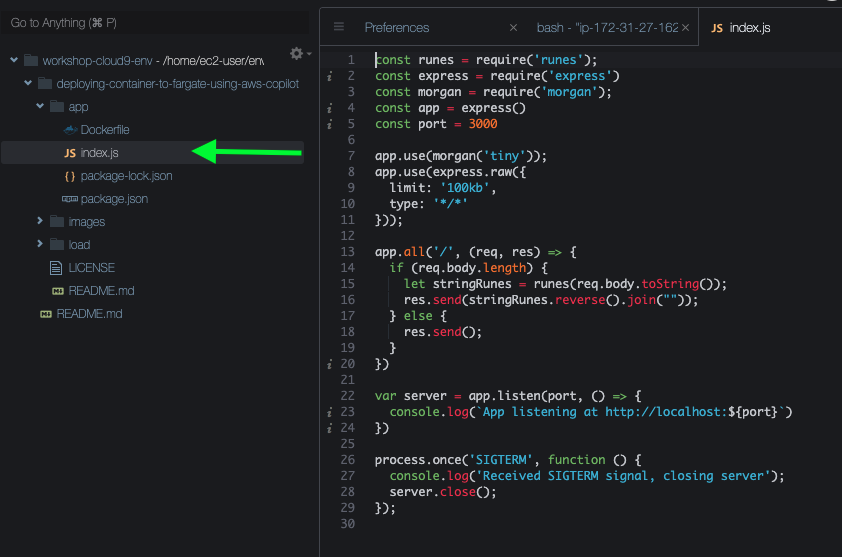

This file is the main application code for the sample application that will be deployed. It is a basic Node.js Express microservice that just accepts arbitrary string payloads, and then reverses and returns them.

You can run this microservice locally on the Cloud9 environment even though it is not yet containerized.

Go back to the terminal that you opened in Cloud9 and run:

```sh
cd deploying-container-to-fargate-using-aws-copilot/app
npm install
node index.js
```

Open a new terminal the same way that you did before and run the following command a few times to send some strings to reverse:

```sh
curl -d "this is a test" localhost:3000
```

If you go back to the other terminal tab where you launched the application you can see logs from the running application.

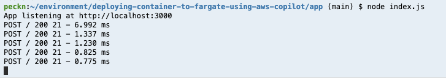

Press Control + C in that tab to send a quit signal to the application and close it.

## Step Three: Create a Dockerfile for the application

Now that you have seen the application running, it is time to package this application up into a container image that can be run on AWS Fargate.

<details>
  <summary>Create a new file called `Dockerfile` inside of the `app` folder.</summary>

  
</details>

Copy and paste the following content into the Dockerfile:

```Dockerfile
FROM public.ecr.aws/bitnami/node:16 AS build
WORKDIR /srv
ADD package.json package-lock.json ./
RUN npm install

FROM public.ecr.aws/bitnami/node:16-prod
WORKDIR /srv
COPY --from=build /srv .
ADD . .
EXPOSE 3000
CMD ["node", "index.js"]
```

This file defines how to construct a Docker container image for the application. It uses a multistage build. The first stage is run inside a full Node.js development environment that has NPM, and the full package build dependencies, including a compiler for native bindings. The second stage uses a slim Node.js environment that just has the Node runtime. It grabs the prebuilt packages from the previous stage, and it adds the application code.

You can verify that this Dockerfile builds by running:

```sh
cd app
docker build -t app .
```

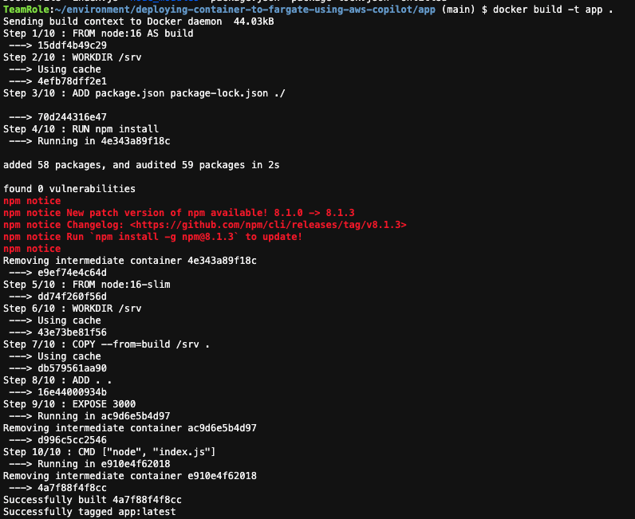

## Step Four: Run the application locally on the Cloud9 Instance

Now that the Docker container image is built, you can run the container image on the development instance to verify that it will work:

```sh
docker run -d -p 3000:3000 --name reverse app
```

This command has a few components to recognize:

- `docker run` - What you want to happen: run a container image as a container
- `-d` - Run the container in the background
- `-p 3000:3000` - The application in the container is binding to port 3000. Accept traffic on the host at port 3000 and send that traffic to the contianer's port 3000.
- `--name reverse` - Name this copy of the running container `reverse`
- `app` - The name of the container image to run as a container

You can now check to verify that the container is running:

```sh
docker ps
```


Last but not least you can send traffic to the containerized application in the same way that you sent traffic when it was running directly on the host:

```sh
curl -d "this is a test" localhost:3000
```

And you can see the logs for the running container with:

```sh
docker logs reverse
```

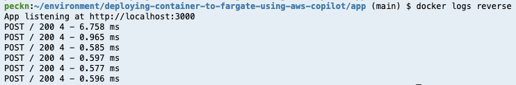

You can stop the container and verify it has stopped by running:

```sh
docker rm -f reverse
docker ps
```

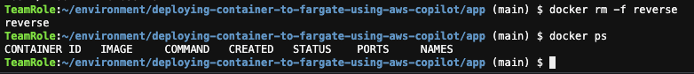

## Step Five: Use AWS Copilot to build and deploy the application on AWS Fargate

Now that you have built and run a container in the development environment, the next step is to run the container as a horizontally scalable deployment in AWS Fargate. For this step we will use AWS Copilot.

```sh
copilot init
```

Copilot will ask you what you would like to name your application. Type the name of the application like "reverse":

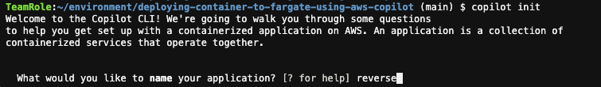

Next Copilot will ask what type of application architecture you want to deploy. Use the down arrow to select "Load Balanced Web Service" and press enter:

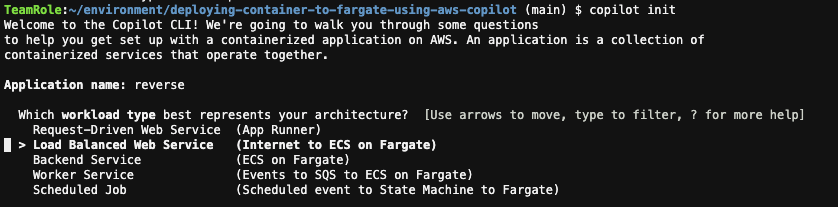

Now Copilot asks what to name the service. Copilot
organizes your code deployments into a tree:

- Application
  - Service

So now we need to name the service that is deployed inside of the `reverse` application. You can name the service `reverse` as well:

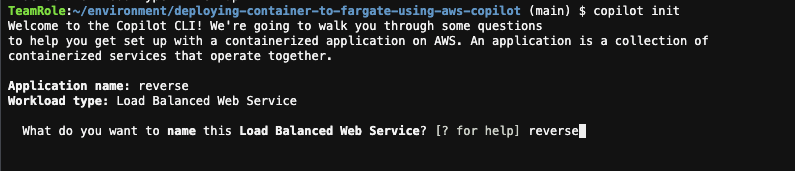

Now Copilot will search the project directory to find Dockerfile's to deploy. Choose the `app/Dockerfile` entry:

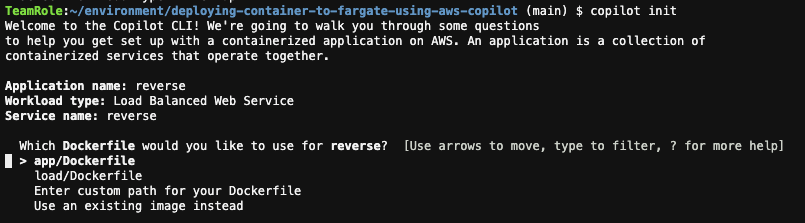

You will see a spinner while Copilot initializes
the application environment:


Finally, Copilot asks if you want to deploy a test environment. Press `y` and then Enter:

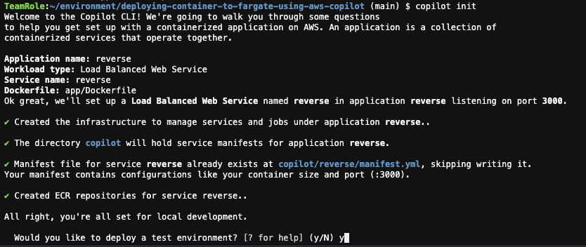

At this point all the major decisions have been made, and you can sit back and watch Copilot do it's work on your behalf.

First Copilot creates the environment resources. This includes all the networking resources needed to have your own private cloud networking:

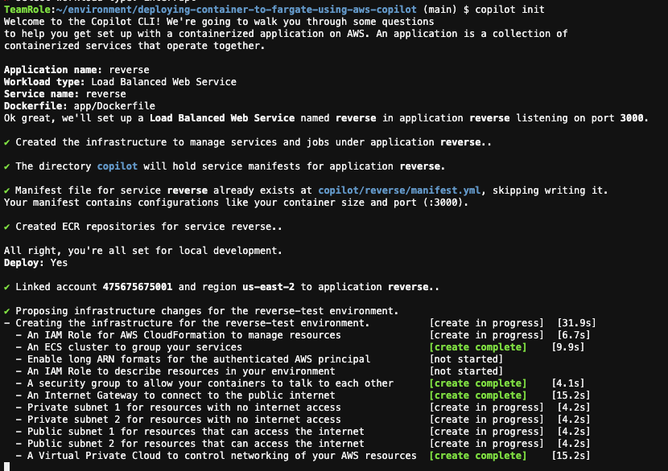

Next Copilot starts deploying your application into the environment. It builds and pushes the container. Then it launches the application resources:

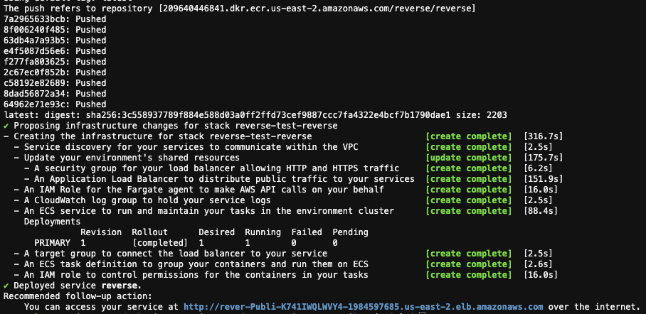

At the end of the output you will see a URL for the deployed application.

You can use this URL to send requests over the internet to your application:

```sh
curl -d "this is a test" <your environment url>
```

Last but not least you can use Copilot to fetch the logs for your running application:

```sh
copilot svc logs
```


This time the logs are being fetched down from AWS Cloudwatch to display locally.

You can also display the current status of the application with:

```sh
copilot svc status
```


## Step Six: Deploy a load test job using AWS Copilot

We have a basic service deployment running, which is fine for a development service, but what if you want the application to be production ready.

First let's increase the size of the deployment so that there are more reverse application containers running.

Open up the file at `copilot/reverse/manifest.yml` and
make the following changes:

```yml
cpu: 1024       # Number of CPU units for the task.
memory: 2048    # Amount of memory in MiB used by the task.
count: 3       # Number of tasks that should be running in your service.
```

Then run:

```sh
copilot deploy
```

This will update the deployment to run 3 containers that have more compute and memory resources, so that they can handle more traffic.

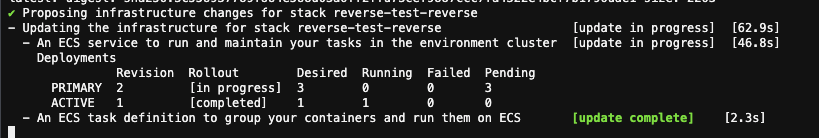

Once this completes we can deploy a load test job that generates traffic for this service. Start out by running:

```sh
copilot job init
```

First Copilot will ask for a name for the job. Type "load":

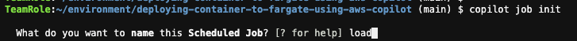

Next Copilot will ask which Dockerfile you want to run. Choose the
`load/Dockerfile` one:

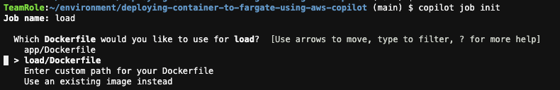

Next you are asked how you want to schedule the job. Choose "Rate":

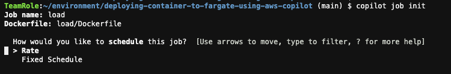

Last it will ask how long to wait between job executions. Type "1m" for 1 minute:

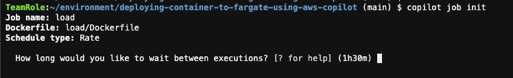

You will see that Copilot writes a manifest file to `copilot/load/manifest.yml`. This describes the job to run. We need to customize this a little bit. Open up the file and make the following change:

```yml
# Configuration for your container and task.
image:
  # Docker build arguments. For additional overrides: https://aws.github.io/copilot-cli/docs/manifest/scheduled-job/#image-build
  build: load/Dockerfile

# Add this command to run
command:
  -c 100 -n 10000 -d='this is a test string' <your deployed reverse app url>
```

For example it should look something like this:

```yml
# Configuration for your container and task.
image:
  # Docker build arguments. For additional overrides: https://aws.github.io/copilot-cli/docs/manifest/scheduled-job/#image-build
  build: load/Dockerfile

# Add this command to run
command:
  -c 100 -n 100000 -d='this is a test string'  http://rever-Publi-K741IWQLWVY4-1984597685.us-east-2.elb.amazonaws.com
```

This configures the command that the load test will run. There are a few components:

- `-c 100` - Send up to 100 concurrent requests
- `-n 100000` - Send a total of 100k requests
- `-d='this is a test string` - The request payload
- `http://rever-Publi-K741IWQLWVY4-1984597685.us-east-2.elb.amazonaws.com` - The URL to send requests to

Once the load test manifest file is defined you should deploy it with:

```sh
copilot job deploy --name load --env test
```

You will see the status as Copilot creates the job:

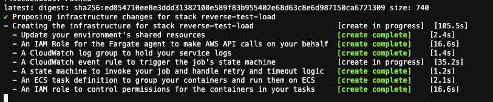

## Step Seven: Look at CloudWatch to read the metrics

Once the job is deployed we can open up the Amazon ECS console to view the reverse service and start watching it's activity.

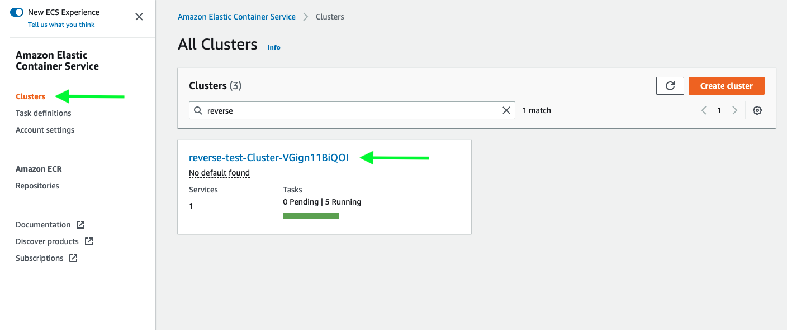

Open the cluster list and select the "reverse" cluster that appears there.

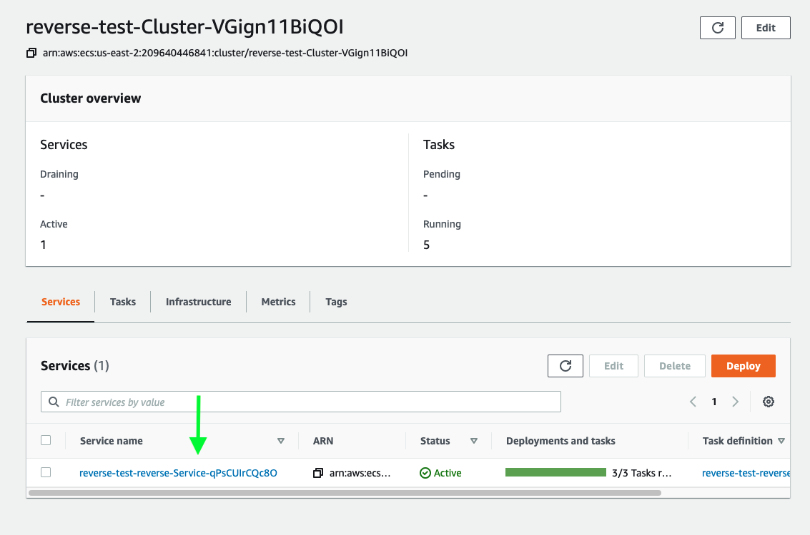

Inside of the cluster you will see a list of services. Select the "reverse" service. In the service details you will see the service health. Click the "Add to dashboard" button to open a dashboard where you can view higher resolution metrics for the service.

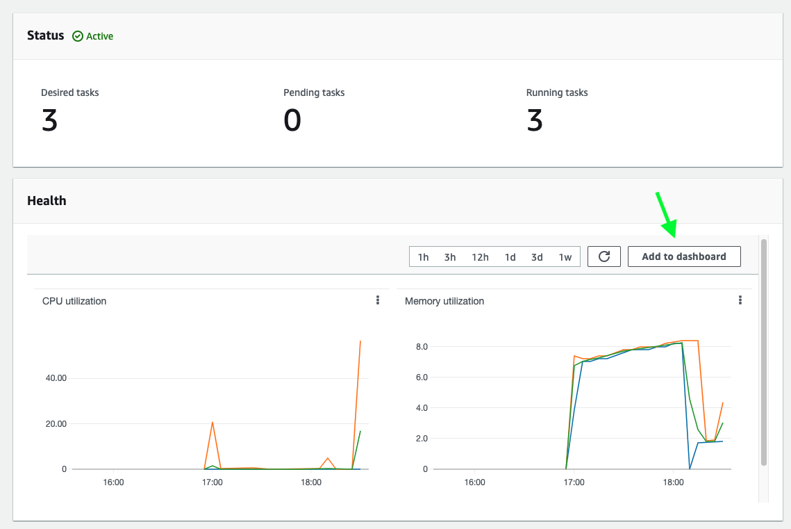

Click "Create new", enter a dashboard name like "reverse-dashboard" and click "Create". Then click "Add to Dashboard".

Now you see a dashboard with the metrics for the service. You can edit these widgets to make them higher resolution:

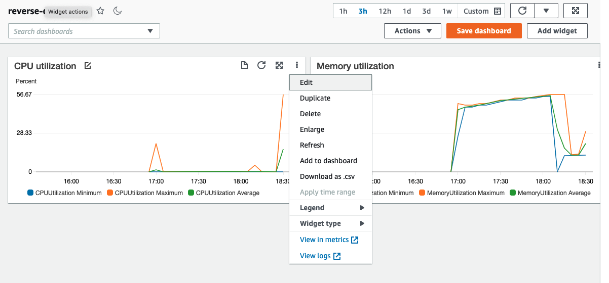

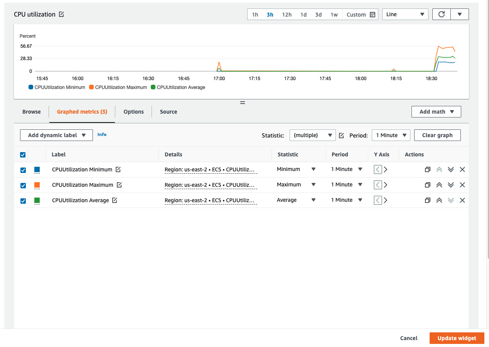

Adjust the resolution down to 1 minute to get higher resolution metrics for your service and click "Update Widget". You can do the same for both the CPU and memory graph.

Last but not least you may want to see additional metrics such as the traffic. Click on "Add widget" and choose a "Line" widget, then choose "Metrics" as the data source.

Then choose the "ApplicationELB" category -> "TargetGroup" category and select the "RequestCountPerTarget" metric for the "reverse" target. You can switch to the "graphed metrics" tab to adjust how the metric is displayed. You should choose "Sum" and "1 min" resolution. Finally click "Create widget":

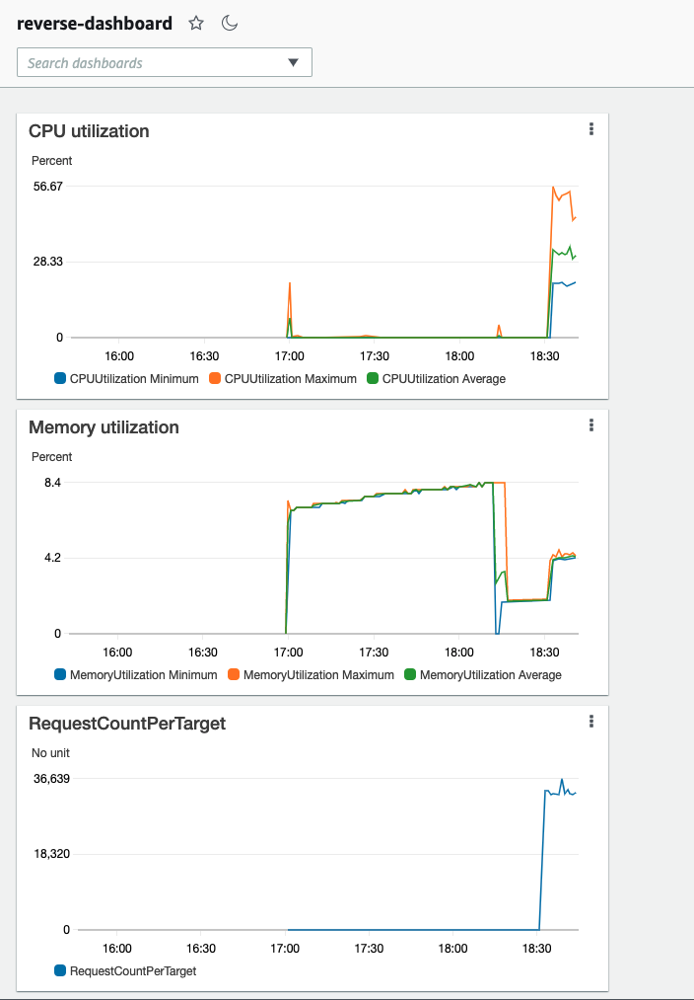

For an extra bonus are there are other things you are interested in about your service? You can add graphs for 2xx requests, 5xx requests, average or p99 latency, a log widget, etc. Once you are happy with the dashboard you have built you can either click "Save dashboard" to persist it for future reference, or just navigate away to discard it.

## Step Seven: Tear everything down

If you want to clean everything up you can go back to Cloud9 and run:

```sh
copilot app delete
```

This will delete all resources grouped under the application, including the `reverse` service and the `load` job.
