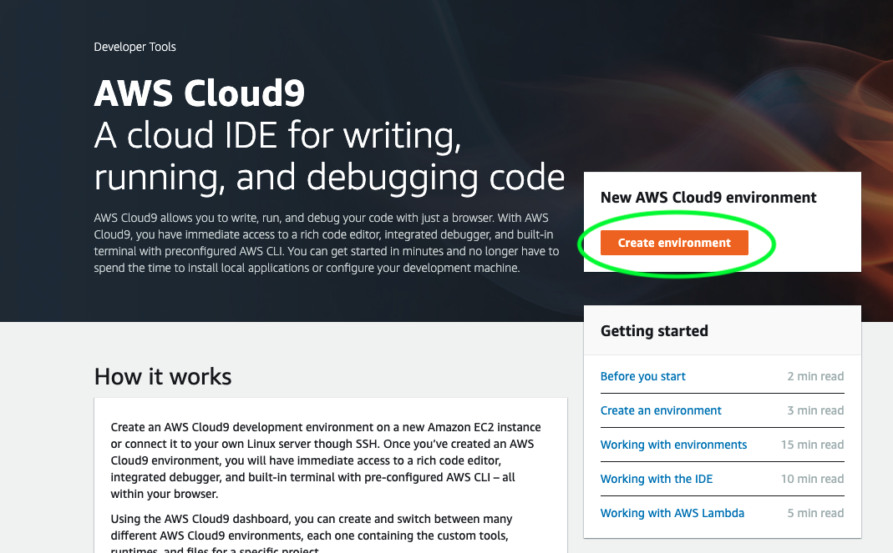
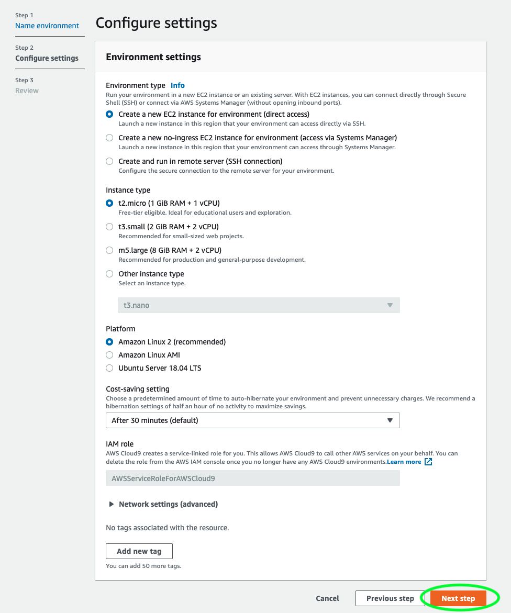
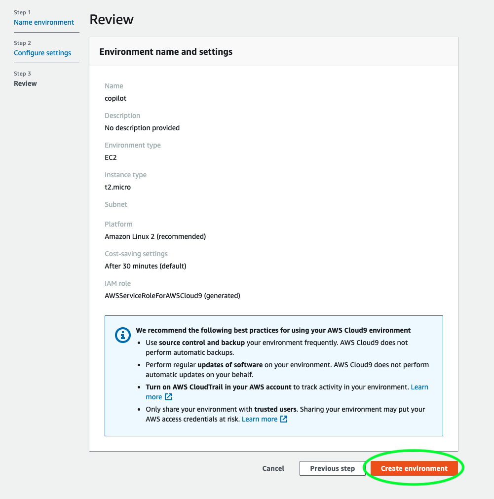
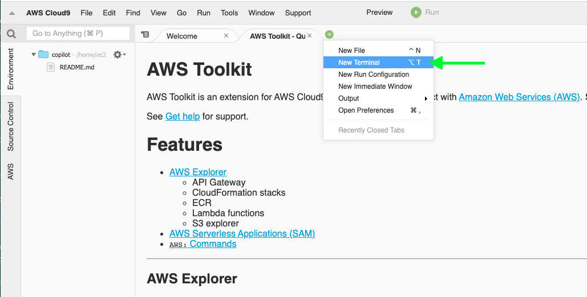

# Deploying a container to AWS Fargate using AWS Copilot

## Step One: Setup a cloud development environment

Log in to your AWS account and open the [AWS Cloud9](https://console.aws.amazon.com/cloud9) console, then click "Create Environment"



Name your environment and click "Next Step"


You can retain the basic default settings for the environment. Just click "Next Step" again:



Now click on "Create Environment"



It will take a couple of minutes to provision and launch the environment:


Once the environment is ready you can click the plus button and select "New Terminal" to open a command line terminal connected to the remote environment:



In the terminal you can now run the command to install the latest version of AWS Copilot, and verify that it runs:

```sh
curl -Lo copilot https://github.com/aws/copilot-cli/releases/latest/download/copilot-linux
chmod +x copilot
sudo mv copilot /usr/local/bin/copilot
copilot --help
```

Last you should clone this repo inside of the environment in order to pull in the code that will be used:

```sh
git clone https://github.com/nathanpeck/deploying-container-to-fargate-using-aws-copilot.git
```

## Step Two: Meet the sample application
