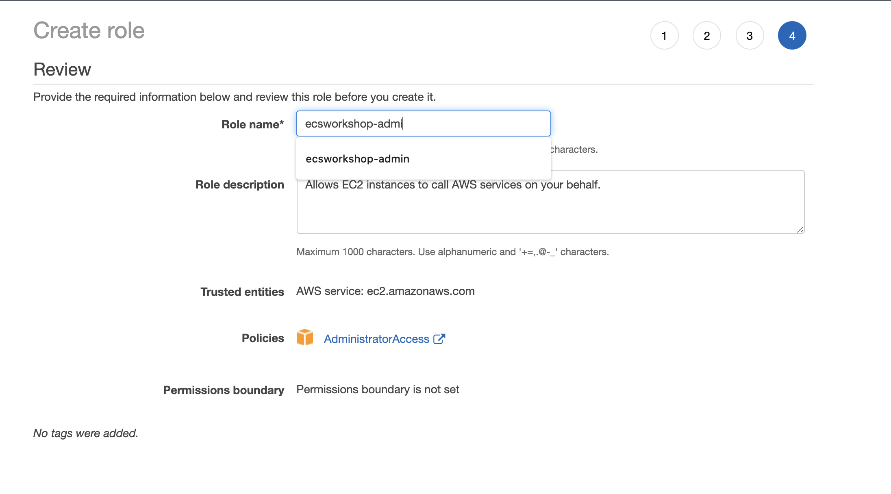
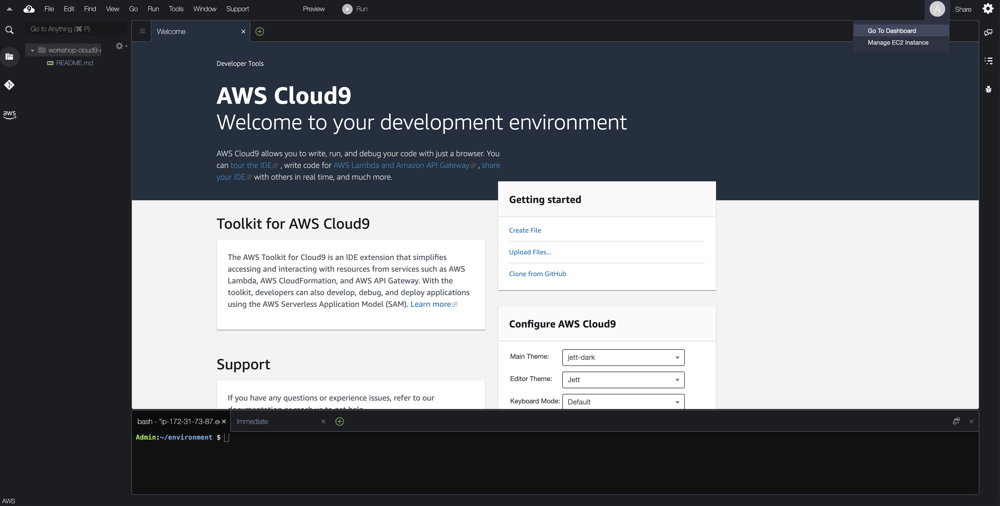
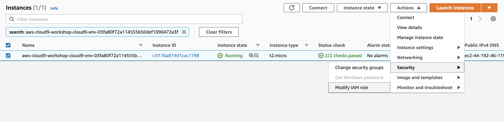
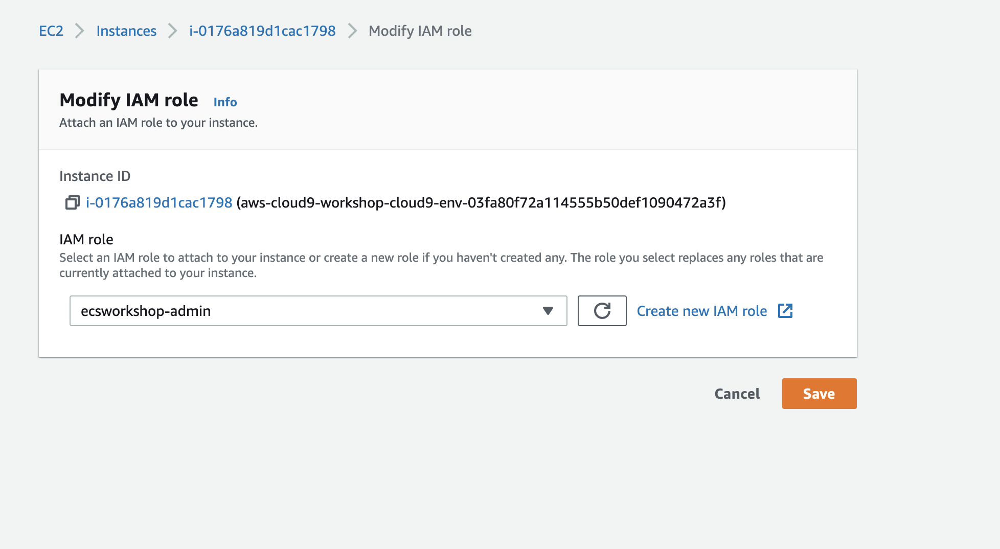

# Running the workshop on your own

Please follow below steps if you are running the workshop on your own. These steps will not be necessary if you are at AWS hosted event (such as re:Invent, Immersion Day, etc).

## Create an IAM role for your Workspace

1. Follow [this deep link to create an IAM role with Administrator access](https://console.aws.amazon.com/iam/home?#/roles$new?step=type&commonUseCase=EC2%2BEC2&selectedUseCase=EC2&policies=arn:aws:iam::aws:policy%2FAdministratorAccess&roleName=ecsworkshop-admin).
1. Confirm that **AWS service** and **EC2** are selected, then click **Next: Permissions** to view permissions.
1. Confirm that **AdministratorAccess** is checked, then click **Next: Tags** to assign tags.
1. Take the defaults, and click **Next: Review** to review.
1. Enter **ecsworkshop-admin** for the Name, and click **Create role**.

## Attach the IAM role to your Workspace
1. Click the grey circle button (in top right corner) and select **Manage EC2 Instance**.

1. Select the instance, then choose **Actions / Security / Modify IAM Role**

1. Choose **ecsworkshop-admin** from the **IAM Role** drop down, and select **Save**

